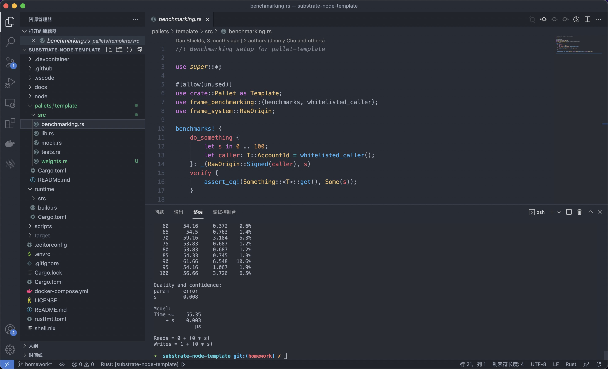

# 第6课作业
## 1. benchmark
- 代码Github链接  
https://github.com/lost-inwind/substrate-node-template/tree/homework/pallets/template/src

- 代码运行截图  

## 2. Chain Spec
- 代码Github链接  
https://github.com/lost-inwind/substrate-node-template/tree/homework/node/res

- 代码运行截图  
